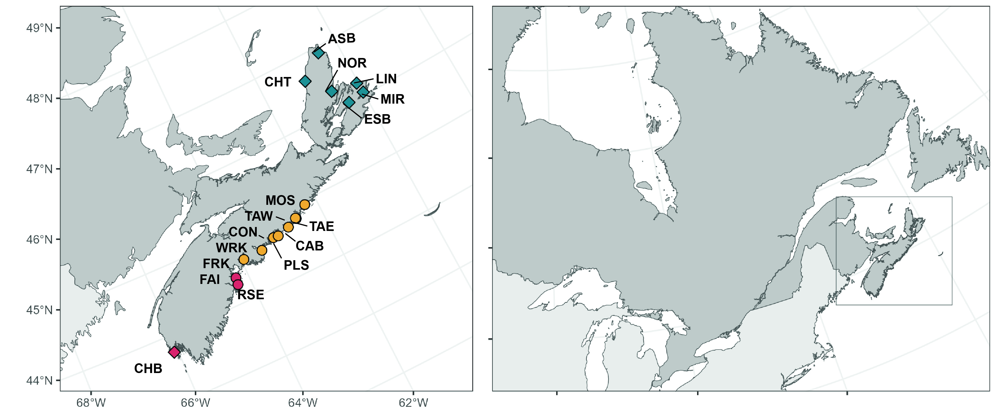
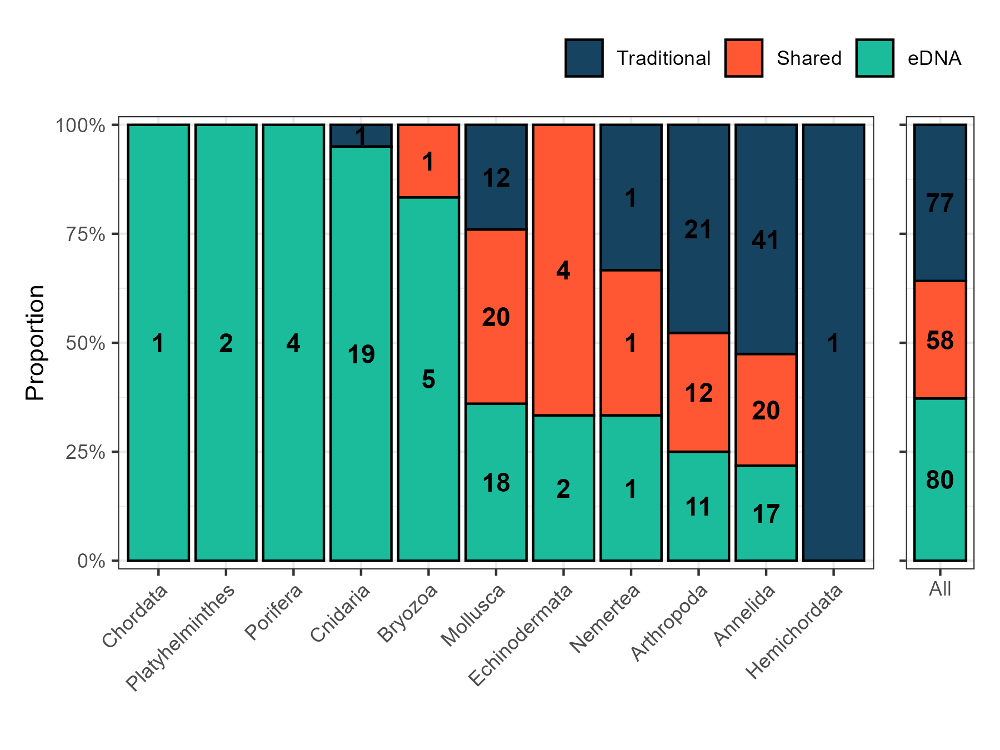
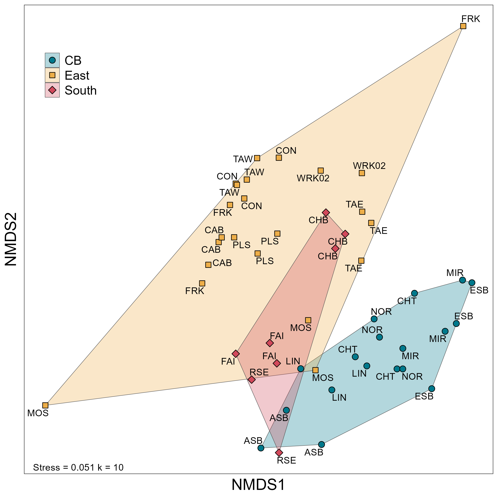
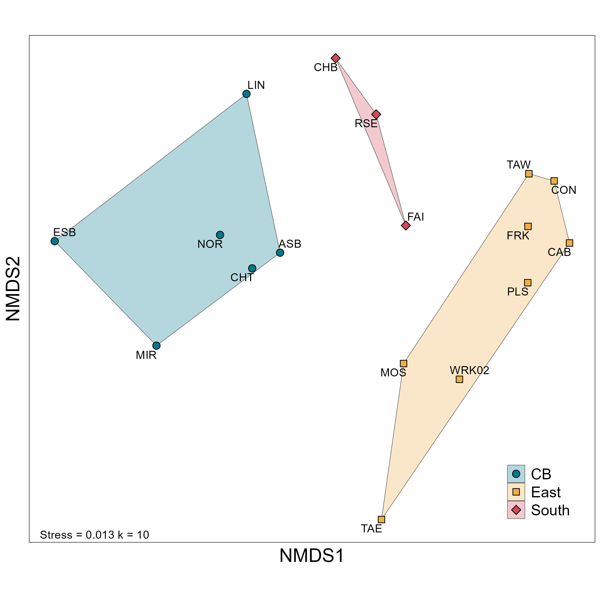
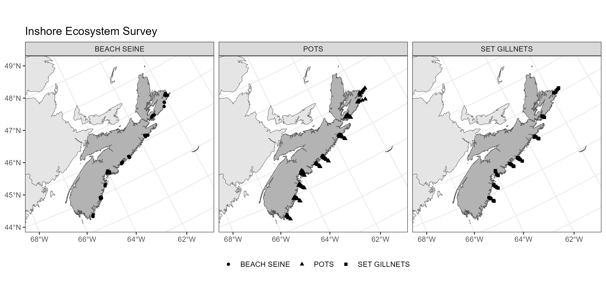

## Applying eDNA metabarcoding to reveal marine invertebrate diversity in Atlantic eelgrass (*Zostera marina*) meadows

__Fig 1.__ Study region for marine invertebrate diversity analysis within eelgrass (*Zostera marina*) beds. Points denote location of samples.  

__Fig 2.__ Comparison between eDNA and traditional sampling methods for invertebrate diversity in coastal Nova Scotia eelgrass beds. 

__Fig 3.__ MetaNMDS analysis of invertebrate species composition (presence-absence) in coastal Nova Scotia eelgrass beds. Analysis based on Jaccard dissimilarity.

__Fig 4.__ MetaNMDS analysis of aggregate invertebrate species composition (presence-absence) in coastal Nova Scotia eelgrass beds. Analysis based on Jaccard dissimilarity.

__Fig 5.__ Inshore Ecosystem Survey locations from 2007 that will be used as a point of comparison. 

